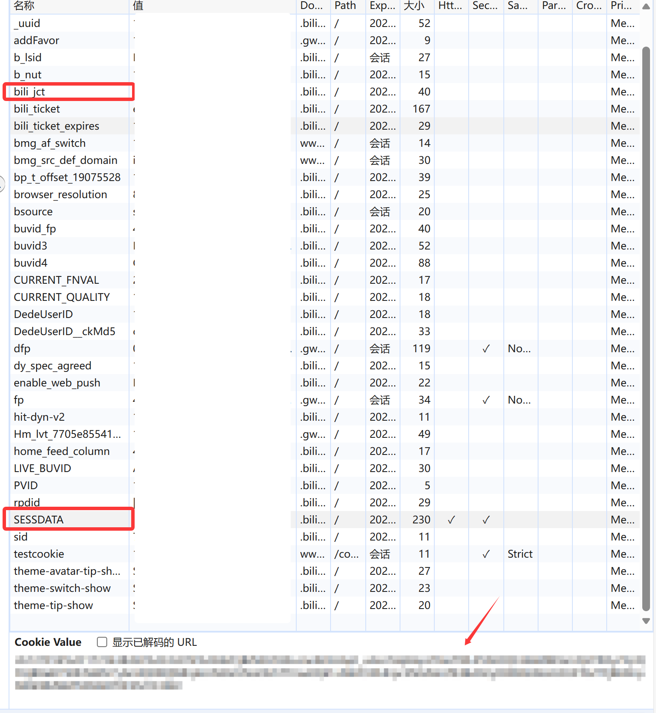

# 🎵 TS3AudioBot-bilibili 插件

> 基于xxmod的 TS3AudioBot-BiliBiliPlugin 开发，重构并添加了新功能，例如批量添加视频合集、视频分P、队列管理等实用功能。


[](https://github.com/xxmod/TS3AudioBot-BiliBiliPlugin)
[](LICENSE)
[](https://dotnet.microsoft.com/download/dotnet/3.1)

## ✨ 功能特性

- **无损优先**：播放时，优先尝试 Hi-Res 音质。

- **状态同步**：播放时，自动修改 Bot 的头像昵称，适配当前播放歌曲的封面与标题。

- **批量添加**：一键添加视频的全部分P或所在合集到播放列表。

- **队列管理**：完整列表管理(!b ls)及播放控制（下一首、跳转、移除等）。

- **播放模式**：顺序播放、列表循环和单曲循环自由切换。

- **独立用户**：支持Cookie登录/二维码，每位用户的登录信息都独立保存。

- **历史点播**：支持通过历史记录，点播已看过的视频。

## 📦 安装方法

### 方法一：docker快速安装（推荐）

详见视频：等我更新

1. **安装 Docker**

   - 请参考 [Docker 官方文档](https://docs.docker.com/get-docker/) 安装 Docker。

2. **拉取ts3audiobot镜像**

   - [TS3AudioBot_docker](https://github.com/getdrunkonmovies-com/TS3AudioBot_docker)

3. **下载插件和代理镜像**

   - 下载 [BilibiliPlugin.dll]

   - 下载 [Bilibili-Referer-Proxy-R](https://github.com/HuxiaoRoar/Bilibili-Referer-Proxy-R/releases/tag/v1.0.2)

4. **复制和安装**

   - 配置proxy代理，启动容器。

   - 将 `BilibiliPlugin.dll` 复制到 `TS3AudioBot/Plugins/` 目录下。

5. **启动ts3audiobot容器**

   - 启动 TS3AudioBot 容器，初始化配置。

6. **权限配置**
   打开根目录下的`rights.toml` 修改权限

   - 管理员权限配置部分：
    
      在`useruid`一项，填写自己的UID。UID在频道内查看。

      ```
      # Admin rule
      [[rule]]
         # Set your admin Group Ids here, ex: [ 13, 42 ]
         groupid = []
         # And/Or your admin Client Uids here
         useruid = ["此处填入你自己的UID"]
         # By default treat requests from localhost as admin
         ip = [ "127.0.0.1", "::1" ]
         "+" = "*"
      ```

   - 播放权限配置部分：
    
      本插件可用命令如下
         
      ```toml
         "cmd.b",
         "cmd.b.qr",
         "cmd.b.status",
         "cmd.b.login",
         "cmd.b.history",
         "cmd.b.h",   
         "cmd.b.addh", 
         "cmd.b.v", 
         "cmd.b.vp", 
         "cmd.b.vall",
         "cmd.b.add", 
         "cmd.b.addp",
         "cmd.b.addall",
         "cmd.b.ls",
         "cmd.b.mode",
         "cmd.b.next",
         "cmd.b.pre",
         "cmd.b.go",
         "cmd.b.remove",
         "cmd.b.move",
         "cmd.b.clear"
      ```

     `useruid` 填写你想赋予权限的用户UID，并将所有的指令复制进去。

      ```
      # Playing rights
      [[rule]]
      # Set Group Ids you want to allow here, ex: [ 13, 42 ]
      groupid = []
      # And/Or Client Uids here, ex [ "uA0U7t4PBxdJ5TLnarsOHQh4/tY=", "8CnUQzwT/d9nHNeUaed0RPsDxxk=" ]
      useruid = ["此处填入赋权用户的UID"]
      # Or remove groupid and useruid to allow for everyone

      "+" = [
      # Basic stuff
      "cmd.help.*",
      "cmd.pm",
      "cmd.subscribe",     
      ......
      "cmd.bot.use",
      "cmd.rights.can",

      #此处添加Bilibili插件权限
      "cmd.b",
      "cmd.b.qr"
      ......
      ]

      ```
   - 如果是私人频道，可以直接删除`groupid`和`useruid` ，权限填写通配符，给所有人所有权限

      ```
      # Admin rule
      [[rule]]
         # Set your admin Group Ids here, ex: [ 13, 42 ]    
         # And/Or your admin Client Uids here    
         # By default treat requests from localhost as admin
         ip = [ "127.0.0.1", "::1" ]
         "+" = "*"
      ```
7. **机器人赋权**
   - 在频道内，给机器人赋予管理员权限。
8. **加载插件**
   - 通过命令加载插件
 
      ```
      !plugin lists          # 查看插件列表
      !plugin load [插件编号]  # 加载 Bilibili 插件
      ```


### 方法二：win安装

1. **下载插件和代理服务**

   - 下载 [BilibiliPlugin.dll](https://github.com/HuxiaoRoar/TS3AudioBot-/blob/main/bin/Release/netcoreapp3.1/BilibiliPlugin.dll)
   - 下载 [bilibili-referer-proxy](https://github.com/HuxiaoRoar/Bilibili-Referer-Proxy-R/releases/download/v1.0.2/Proxy.zip)
2. **文件部署**

   - 将 `BilibiliPlugin.dll` 放置于 `TS3AudioBot/Plugins/` 目录下
   - 解压代理服务到任意目录，并启动exe
3. **权限配置** 同上
4. **机器人赋权** 同上
5. **加载插件** 同上

## 📖 详细使用教程

### 🔐 用户登录

#### Cookie 登录（推荐）

```
!b login SESSDATA=你的SESSDATA; bili_jct=你的bili_jct;
```

- **b站现在对多端使用进行限制，最多同时两个设备，播放会员权限内容。**
- 使用已登录cookie意味着共用一台设备，肯定不算新设备。
- 手动输入 Cookie 信息进行登录
- 适合高级用户或批量部署

#### 二维码登录

```
!b qr
```

- 发送命令后会生成二维码链接
- 使用 Bilibili APP 扫描二维码
- 系统会自动检测登录状态并保存凭据
- 每个用户的登录信息独立保存
- *不确定是否算新设备登录*

#### 登录状态校验

```
!b status
```

- 查看当前用户的登录状态
- 显示用户名和会员详情
- 显示代理服务器状态

### 🎵 音频播放、添加

#### 1.基础播放命令

```
!b v BV1UT42167xb
```

- 播放指定 BV 号的视频音频
- 如果是多P视频，会显示分P列表供选择
- 单P视频会直接开始播放

#### 2.添加到播放队列

```
!b add BV1UT42167xb
```

- 将视频音频添加到播放队列，不会立即播放

#### 3.批量播放

```
!b vall BV1UT42167xb 
```

- 播放该视频，并将合集剩余视频，旋转添加到队列

#### 4.批量添加

```
!b addall BV1UT42167xb
```

- 将视频合集全部添加到队列，该视频将作为队首，其余视频旋转添加

### 🎶多P视频

#### 方法一、单一分P视频（推荐）

用`-`号链接分P编号
```
!b bv BV1UT42167xb-1    # 直接播放1p
!b add BV1UT42167xb-1   # 添加1p到播放列表
```

#### 方法二、全部分P视频（推荐）

bv号后面加上`-a`
```
!b v BV1UT42167xb-a     # 播放1P并添加全部分P到播放列表
!b add BV1UT42167xb-a   # 添加全部分P到播放列表
```

#### 方法三、先获取再选择

```
# 首先获取视频信息
!b bv BV1UT42167xb

# 系统会显示：
# 视频包含 3 个分P：
# 1. 第一集：开场
# 2. 第二集：正片
# 3. 第三集：片尾
# 
# 请使用命令 !b p [编号] 播放对应分P。

# 播放指定分P
!b vp 2    # 播放第二集
```

### 📜 历史记录功能

#### 查看观看历史

```
!b history
```

- 显示最近观看的10个视频
- 需要登录账号
- 显示格式：编号. 视频标题
- 只能查看请求发起者的账号历史记录（a登录账号，b无法查a）

#### 播放历史视频

```
!b h 3     # 播放历史记录第3个视频
!b addh 3  # 将历史记录第3个视频添加到队列

```

- 只会添加、播放已看过过的分p视频，看过4p，添加4p

### 🎼 队列管理

#### 查看当前播放队列

```
!b ls
!b ls 3 # 跳转到第三页
```

- 显示当前播放队列中的视频信息

#### 清空队列
```
!b clear
```

- 暂停播放并清空当前播放队列

#### 队列控制

```
!b next       # 播放下一首
!b pre        # 播放上一首
!b go 3       # 跳转播放队列中的第3首
!b remove 3   # 移除队列中的第3首
!b move 3 1   # 将队列中的第3首移动到第1首
!b mode 3     # 切换播放模式，1=顺序播放，2=列表循环，3=单曲循环
```


## 📋 完整命令列表

| 命令         | 参数         | 功能描述                                     | 示例                                   |
| ------------ | ------------ | -------------------------------------------- | -------------------------------------- |
| `!b qr`      | 无           | 生成二维码进行登录                           | `!b qr`                                |
| `!b login`   | Cookie字符串 | 使用Cookie登录                               | `!b login SESSDATA=xxx; bili_jct=xxx;` |
| `!b status`  | 无           | 查看当前用户登录状态                         | `!b status`                            |
| `!b history` | 无           | 查看最近10条观看历史                         | `!b history`                           |
| `!b h`       | 历史编号     | 播放历史记录中的视频                         | `!b h 3`                               |
| `!b addh`    | 历史编号     | 添加历史视频到播放队列                       | `!b addh 3`                            |
| `!b v`       | BV号         | 播放指定BV号的视频                           | `!b v BV1UT42167xb`                    |
| `!b v`       | BV号-分P编号 | 播放指定BV分p的视频                          | `!b v BV1UT42167xb-1`                  |
| `!b v`       | BV号-a       | 播放指定BV全部分p的视频                      | `!b v BV1UT42167xb-a`                  |
| `!b vp`      | 分P编号      | 播放当前视频的指定分P                        | `!b vp 2`                              |
| `!b vall`    | BV号         | 播放指定BV号的视频，并将视频合集加入队列     | `!b vall BV1UT42167xb`                    |
| `!b add`     | BV号         | 添加视频到播放队列                           | `!b add BV1UT42167xb`                  |
| `!b add`     | BV号-分P编号 | 播放指定BV分p的视频                          | `!b add BV1UT42167xb-1`                |
| `!b add`     | BV号-a       | 播放指定BV全部分p的视频                      | `!b add BV1UT42167xb-a`                |
| `!b addp`    | 分P编号      | 添加指定分P到播放队列                        | `!b addp 2`                            |
| `!b addall`  | BV号         | 将视频合集加入队列，指定BV号的视频将作为队首 | `!b addall BV1UT42167xb`                  |
| `!b ls`      | 无           | 查看当前播放队列                             | `!b ls`                                |
| `!b ls`      | 页码         | 查看播放队列指定页数                         | `!b ls 3`                                |
| `!b clear`   | 无           | 清空当前播放队列                             |  `!b clear`                             |
| `!b next`    | 无           | 播放下一首                                   | `!b next`                               |
| `!b pre`     | 无           | 播放上一首                                   | `!b pre`                                |
| `!b go`      | 队列编号     | 跳转播放队列中的指定编号                     | `!b go 3`                               |
| `!b remove`  | 队列编号     | 移除播放队列中的指定编号                     | `!b remove 3`                           |
| `!b move`    | 队列编号1 队列编号2 | 将队列中的指定编号3移动到编号1位置 | `!b move 3 1`                           |
| `!b mode`   | 模式编号     | 切换播放模式，1=顺序播放，2=列表循环，3=单曲循环 | `!b mode 3`                             |

## 📣频道描述

**复制到频道说明，便于用户使用**

```
[COLOR=#fb7299]Bilibili：[/COLOR]
1.生成二维码扫码登录
[COLOR=#fb7299]!b qr[/COLOR]
2.使用Cookie登录
[COLOR=#fb7299]!b login SESSDATA=xxx; bili_jct=xxx;[/COLOR]
3.查看当前登录状态
[COLOR=#fb7299]!b status[/COLOR]
-------------------------------------------
4.查看播放列表 (可指定页数)
[COLOR=#fb7299]!b ls[/COLOR] 或 [COLOR=#fb7299]!b ls [页码][/COLOR]
5.清空bilibili播放列表
[COLOR=#fb7299]!b clear[/COLOR]
6.播放下一首
[COLOR=#fb7299]!b next[/COLOR]
7.播放上一首
[COLOR=#fb7299]!b pre[/COLOR]
8.跳转到指定歌曲
[COLOR=#fb7299]!b go [队列编号][/COLOR]
9.移除指定歌曲
[COLOR=#fb7299]!b remove [队列编号][/COLOR]
10.移动歌曲
[COLOR=#fb7299]!b move [原位置] [目标位置][/COLOR]
11.改变播放模式
[1=顺序播放 2=列表循环 3=单曲循环]
[COLOR=#fb7299]!b mode [模式编号或名称][/COLOR]
-------------------------------------------
12.播放指定视频 (若为多P视频，会列出分P)
[COLOR=#00AEEC]!b v [BV号][/COLOR]
13.播放指定分P
[COLOR=#00AEEC]!b v [BV号-分P编号][/COLOR]
14.播放视频的全部P
[COLOR=#00AEEC]!b v [BV号-a][/COLOR]
15.播放并添加整个合集 (从指定BV开始)
[COLOR=#00AEEC]!b vall [合集中的任一BV号][/COLOR]
16.添加视频到队列
[COLOR=#00AEEC]!b add [BV号][/COLOR]
17.添加指定分P到队列
[COLOR=#00AEEC]!b add [BV号-分P编号][/COLOR]
18.添加视频的全部P到队列
[COLOR=#00AEEC]!b add [BV号-a][/COLOR]
19.添加整个合集到队列 (从指定BV开始)
[COLOR=#00AEEC]!b addall [合集中的任一BV号][/COLOR]
-------------------------------------------
20.查看最近观看历史
[COLOR=#00AEEC]!b history[/COLOR]
21.播放历史记录中的视频
[COLOR=#00AEEC]!b h [历史编号][/COLOR]
22.添加历史视频到队列
[COLOR=#00AEEC]!b addh [历史编号][/COLOR]
```

## 🔧 故障排除

### Q&A

- Q: 为什么播放时没有头像和昵称变化？或者报错？
  
  A: 请确保 Bot 有修改头像和昵称的权限。

欢迎提issue

### Tips

- 点歌时，可以直接复制bv号，例如 `BV1UT42167xb`，粘贴进对话框，在最前面敲`!`，并在b、v后面各输入一个空格，最后变成`!b v 1UT42167xb`，直接发送即可点歌。
- 还有更简单的，可以用油猴插件，直接从网页点歌，待补充。
- 如果出现HiRes播放失败，请稍等一会再试试，部分特殊cdn可能会导致这个情况。

### 获取 Cookie 方法

1. **打开浏览器**，访问 [bilibili.com](https://www.bilibili.com) 并登录
2. **打开开发者工具**（F12）
3. **切换到 Application(应用程序) 标签页**
4. **在左侧菜单中找到 Cookies**，展开并选择 `https://www.bilibili.com`

5. **查找以下两个值**：

   - `SESSDATA`：形如 `xxx%2Cxxx%2Cxxx*xx`
   - `bili_jct`：形如 `xxxxxxxxxxxxxxxxxxxxxxxxxxxxxxxx`


6. **组合 Cookie**：

   ```
   !b login SESSDATA=你的SESSDATA值; bili_jct=你的bili_jct值;
   ```

7. **注意事项**
   - B站 Cookie有效期挺长的，一般不会失效
   - 请勿泄露 Cookie 信息，避免账号被盗用，**cookie信息相当于账号密码!!!**

## 后续计划

- [x] 支持批量添加视频合集、视频分
- [x] 支持切换音乐后自动更换头像和名字。重构中。。。
- [x] 打印播放列表
- [x] 播放模式选择
- [ ] 自动改回头像和昵称
- [ ] 兼容其他插件

## 🙏 致谢

感谢以下项目和开发者：

- [TS3AudioBot-BiliBiliPlugin](https://github.com/xxmod/TS3AudioBot-BiliBiliPlugin) - 原版插件
- [BiliBili-Referer-Proxy](https://github.com/xxmod/BiliBili-Referer-Proxy) - 解决 B 站链接代理问题
- [bilibili-API-collect](https://github.com/SocialSisterYi/bilibili-API-collect) - 提供详细的 Bilibili API 文档
- [TS3AudioBot-NetEaseCloudmusic-plugin](https://github.com/ZHANGTIANYAO1/TS3AudioBot-NetEaseCloudmusic-plugin) - 提供插件开发参考
- [TS3AudioBot-CloudMusic-plugin](https://github.com/577fkj/TS3AudioBot-CloudMusic-plugin) - 提供插件开发参考
- [TS3AudioBot-Plugin-Netease-QQ](https://github.com/RayQuantum/TS3AudioBot-Plugin-Netease-QQ) - 提供插件开发参考
- [`Splamy/TS3AudioBot`](https://github.com/Splamy/TS3AudioBot) - 优秀的 TeamSpeak 音频机器人框架

## 📄 许可证

本项目基于 MPL2.0 许可证开源，详见 [LICENSE](https://github.com/xxmod/TS3AudioBot-BiliBiliPlugin/blob/main/LICENSE) 文件。

## 🤝 贡献

有任何问题，欢迎提交 Issues与我讨论。


